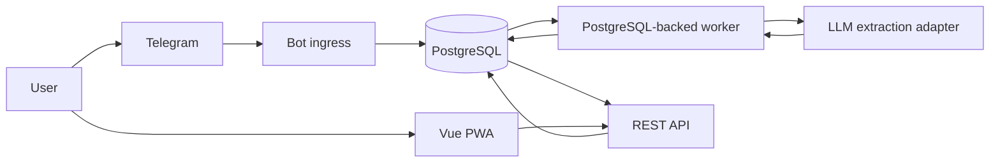

# Architecture

## 1. Recommended shape

One deployable Go application plus PostgreSQL:



The Go binary contains:

- HTTP server and REST API;
- Telegram webhook/long-polling adapter;
- authentication and session management;
- PostgreSQL-backed background worker;
- LLM provider adapter and extraction validator;
- episode projection and deterministic analytics;
- embedded production build of the Vue app;
- health/readiness/metrics endpoints.

There is no Redis, message broker, gRPC gateway or separate frontend deployment in the initial architecture.

## 2. Why a monolith

- A single user and low message volume do not justify distributed coordination.
- Raw entry, extraction job and Telegram deduplication need PostgreSQL transactions.
- One image simplifies Compose, GitLab CI, Flux automation, secrets and rollback.
- Internal package boundaries still allow future extraction of a worker if measured load requires it.

## 3. Technology choices

### Backend

- Current stable Go version supported by GitLab runner and production image.
- `net/http` with a small router such as `chi`.
- `pgx/v5` and `sqlc` for typed queries.
- `golang-migrate` for versioned SQL migrations.
- `slog` or `zap` for structured redacted logs.
- `prometheus/client_golang` for metrics.
- `go-telegram-bot-api/v5` for Telegram Bot API.

### Frontend

- Vue 3 + Vite + TypeScript.
- Vue Router.
- Pinia only if shared client state becomes non-trivial.
- Chart.js for charts.
- Lucide for icons.
- Vitest and Vue Test Utils.
- PWA manifest/service worker may cache the application shell, but never cache authenticated health API responses by default.

### Storage/jobs

- PostgreSQL 16.
- Jobs use `FOR UPDATE SKIP LOCKED`, `available_at`, attempts and exponential backoff.
- One worker loop runs inside the application process initially.

### LLM

- OpenAI-compatible HTTP adapter behind an internal interface.
- Strict JSON Schema response.
- Provider/model/base URL/proxy configured through env.
- Provider-specific retries only for transport errors and `429/5xx` according to `Retry-After`.
- SOCKS5 transports are scoped per outbound client; Telegram uses `TELEGRAM_SOCKS5_PROXY_ADDR` in production and no process-wide `HTTP_PROXY`/`HTTPS_PROXY` is set.

## 4. Processing flow

### 4.1 Telegram message

1. Verify private chat and allowlisted Telegram user.
2. Insert `telegram_updates` with unique `update_id`.
3. In the same transaction insert encrypted `journal_entry` and an extraction `job`.
4. Reply quickly with “Запись принята”.
5. Worker decrypts only the required entry and builds extraction context.
6. Provider returns strict JSON.
7. Backend validates enums, ranges, timestamps and references.
8. Create pending events and update/open/close an episode projection.
9. Send confirmation summary with signed callback data.
10. Confirmation marks events confirmed; correction creates revision/re-extraction.

### 4.2 Web read

1. Browser sends only server session cookie.
2. Middleware resolves session and user.
3. Repository queries are always scoped by `user_id`.
4. API returns normalized data, never LLM raw output.

### 4.3 Analytics

1. Query only `status='confirmed'` and non-deleted events.
2. Compute aggregates in SQL/Go.
3. Cache only derived, non-sensitive aggregates if profiling shows a need.
4. Optional LLM summary receives aggregates, not raw health notes or identifiers.

## 5. Planned repository layout

```text
health-diary/
├── cmd/
│   ├── server/main.go
│   └── migrate/main.go
├── internal/
│   ├── app/
│   ├── auth/
│   ├── bot/
│   ├── config/
│   ├── crypto/
│   ├── database/
│   ├── httpapi/
│   ├── ingest/
│   ├── journal/
│   ├── episode/
│   ├── llm/
│   ├── analytics/
│   ├── export/
│   └── jobs/
├── migrations/
├── queries/
├── web/
├── deploy/
├── docs/
├── Dockerfile
├── docker-compose.yml
├── Makefile
├── sqlc.yaml
└── .gitlab-ci.yml
```

Packages own domain interfaces. Telegram/HTTP/LLM are adapters; they must not contain SQL or analytics formulas.

## 6. Runtime modes

### Development

- PostgreSQL in Compose.
- Telegram long polling.
- Vue dev server with API proxy, or embedded build for parity.
- Optional fake LLM server/fixture mode for deterministic tests.

### Production

- Telegram webhook with secret path/header.
- One application replica initially to avoid duplicate long-running worker concerns; jobs remain safe for multiple replicas.
- Embedded web assets.
- PostgreSQL on RWO PVC.
- TLS at existing Traefik ingress.

## 7. Consistency and idempotency

- Unique `telegram_updates.update_id` prevents duplicated incoming updates.
- Unique `(user_id, source_entry_id, client_ref, extraction_schema_version)` prevents duplicated extracted events.
- Auth challenge is consumed with one atomic conditional update.
- Job claim and completion are transactional.
- Confirmation callback includes event batch ID and version; stale callbacks return a user-friendly message.
- Analytics endpoints are read-only and computed from current confirmed versions.

## 8. Failure behavior

- Telegram unavailable: job retries; entry remains durable.
- LLM unavailable: mark extraction `retryable_failed`, retain entry, expose retry button.
- Invalid LLM JSON: store redacted diagnostics, do not create partial events.
- Bot send failure after DB commit: outbox job retries confirmation delivery.
- Web unavailable: bot capture continues.
- Analytics failure never blocks entry capture.

## 9. Evolution boundaries

Future voice transcription should create the same `journal_entry` with source metadata and transcript provenance. Weather/wearable import should use the same event pipeline but a different source type. A separate worker can be extracted without changing domain tables if volume requires it.
