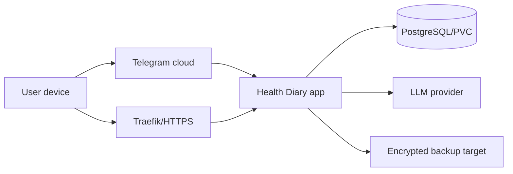

# Security and privacy

## 1. Data classification

Treat all diary content, normalized events, medication data, symptom analytics and exports as highly sensitive health data. Telegram identity, IP/user-agent hashes and authentication records are sensitive identity/security data.

No environment should use production health data for development or tests.

## 2. Trust boundaries

Important facts to show in `/privacy` and product settings:

- Bot private messages are Telegram cloud chats, not Secret Chats with end-to-end encryption.
- Interacting with a third-party bot sends data to the bot developer/service.
- Selected LLM provider receives the minimum diary text required for extraction.

Telegram sources:

- https://telegram.org/privacy (Cloud Chats and Bot Messages sections)
- https://telegram.org/faq (Secret Chats versus Cloud Chats)

## 3. Threat model

Protect against:

- stolen Telegram bot token;
- unauthorized Telegram user messaging the bot;
- replayed webhook/update/callback;
- brute-forced login code;
- stolen web session;
- cross-user query bugs;
- database/PVC/backup disclosure;
- raw health content in logs/traces/metrics;
- LLM provider retention or prompt injection;
- malicious diary text causing tool/system instructions;
- dependency/container vulnerabilities;
- accidental destructive migrations or incomplete deletion.

## 4. Authentication controls

- Allowlist Telegram user IDs initially.
- Telegram deep-link token: cryptographically random, short TTL, stored only as hash.
- OTP: six random digits, hashed with challenge-specific salt/HMAC or a slow hash, single-use, 5-minute default TTL.
- Maximum five attempts; atomic lock/consume.
- Rate limit challenge creation and verification using privacy-preserving IP hash.
- Session token: >=256 bits random, stored only as hash.
- Cookie: `Secure`, `HttpOnly`, `SameSite=Lax` or `Strict`, scoped path, no domain wildcard.
- Rotate session after authentication; revoke all sessions after Telegram allowlist removal or user disable.
- State-changing endpoints require CSRF protection if SameSite alone is insufficient for chosen browser flows.

Existing OTP code may be used as behavioral reference, but implementation must follow this stronger opaque-challenge/session design.

## 5. Authorization

- Repository methods take `user_id` explicitly.
- HTTP handlers never load a health record by ID without user scope.
- Cross-user access returns `404`.
- Background jobs carry entity IDs and resolve owner in DB; payload never grants authorization.
- Admin/debug endpoints must not expose health records. Initial release has no application admin role.

## 6. Encryption and secrets

### In transit

- HTTPS only in production.
- Verify Telegram webhook secret token.
- TLS certificate through existing Traefik/cert setup.
- DB traffic remains cluster-internal; enable TLS if DB topology later crosses nodes/trust boundaries.

### At rest

- Encrypt raw diary text and optional raw LLM response at application level using an authenticated cipher (AES-256-GCM or XChaCha20-Poly1305).
- Store key version beside ciphertext; key material only in Kubernetes Secret.
- Never reuse nonce with the same key.
- Consider encrypting free-form correction/revision text as well.
- Verify storage/backup encryption separately; column encryption does not protect all normalized facts.

### Secrets

- `TELEGRAM_BOT_TOKEN`, webhook secret, session/encryption keys, DB credentials and LLM API key are Kubernetes Secrets.
- LLM model/base URL/proxy/timeouts are ConfigMap values.
- Do not put secrets in GitLab variables marked unprotected for production branches.
- Protect/mask CI variables and restrict production image jobs to protected default branch/tags.

## 7. LLM privacy and injection controls

- Provider is an explicit configuration/ADR decision.
- Strip Telegram ID, username, IP, message ID and session data.
- Send only one entry plus minimal open-episode context.
- Treat input as data; no tools, browsing or side effects in extraction calls.
- Strict schema, size limits and domain validation.
- Do not log request/response bodies.
- `LLM_STORE_RAW_RESPONSE=false` by default.
- Document provider retention/data-training terms before production.
- Global proxies are forbidden; any proxy is scoped to the LLM client.

## 8. Logging, metrics and traces

Allowed structured fields:

- request ID;
- internal opaque entity ID if needed;
- operation, status, duration;
- provider/model name;
- token counts;
- error category;
- queue depth/attempt number.

Forbidden:

- raw diary/correction text;
- LLM prompt/response;
- OTP/session/deep-link token;
- Telegram username/ID/chat ID;
- medication or symptom names as metric labels;
- exported report contents.

Access logs must exclude query/body and redact auth cookies.

## 9. Retention, export and deletion

- Normalized health data remains until user deletion by default.
- Raw entries and normalized health data have no automatic retention deletion at MVP launch. Explicit user deletion remains available and is the only application-triggered deletion of health content.
- Expired auth challenges/sessions/jobs/outbox records are cleaned automatically.
- Exports are encrypted or access-controlled, have short TTL and are deleted after expiry.
- Hard deletion requires a session created within the previous 10 minutes and
  explicit `DELETE_MY_DATA` confirmation. It revokes sessions, runs as a
  durable deletion job and retains only a non-identifying completion audit.
  Encrypted backups expire under their separate retention policy.
- Product must state backup retention honestly: deleted data may persist in encrypted backups until scheduled expiry.

## 10. Telegram deletion limitation

Deleting a record in Health Diary does not automatically prove deletion from Telegram cloud history. The product must distinguish:

- deleting normalized/raw data from this service;
- deleting a Telegram message from the chat;
- expiry of backup copies.

Do not show a single “deleted everywhere” message unless all boundaries are verifiably handled.

## 11. Medical safety boundary

- No diagnosis or causal claims.
- No medication dosage or withdrawal advice.
- Informational trends show sample size and disclaimer.
- Future red-flag detection cannot imply that absence of a warning means safety.
- Any clinician-facing wording or thresholds require a separate reviewed specification.

## 12. Security verification before production

- Threat-model review completed.
- Dependency and container vulnerability scans pass or exceptions documented.
- Auth brute force, session revocation and cross-user tests pass.
- Log scan confirms seeded health markers do not appear.
- Backup encryption and restore are verified.
- Secret rotation runbook tested for bot token, session key, data key and LLM key.
- Data export and deletion are exercised end to end.
- CSP/security headers and cookie flags verified in a browser.
